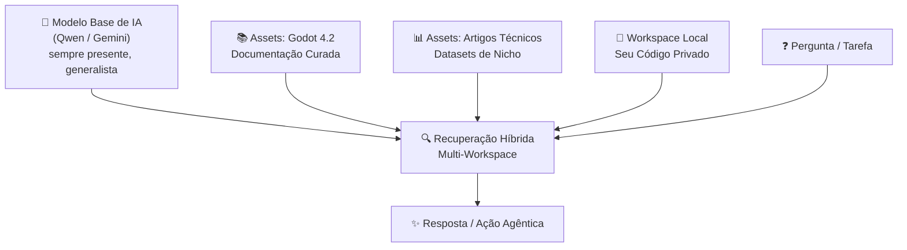

# Adições da Fase Dream (Vectora Phase 2)

Este documento lista exclusivamente as funcionalidades, conceitos e componentes técnicos adicionados na fase **Dream**, partindo da base estabelecida no **MVP**. Ele serve como fonte única de verdade para todas as features Dream — os READMEs específicos da fase foram removidos para evitar duplicação de manutenção.

---

## Posicionamento e Proposta de Valor

**De "RAG para Codebases" para "Motor de Conhecimento Local":**

No MVP, o Vectora era posicionado como uma ferramenta de RAG híbrido para codebases. Na fase Dream, o posicionamento evolui para **Motor de Conhecimento Local** — uma comparação direta com ferramentas como NotebookLM, mas com capacidade de execução agêntica.

> **NotebookLM responde perguntas. O Vectora entende sistemas.**

O Vectora não opera apenas sobre documentos isolados. Ele combina busca semântica, estrutura real de código (arquivos, funções, dependências), grafo de relações e raciocínio multi-hop para entregar respostas e ações baseadas no funcionamento real do seu conhecimento — não em fragmentos isolados.

---

## Novas Interfaces e Aplicativos

**Vectora Desktop (Fyne):**

Aplicação GUI nativa construída com o framework **Fyne** (Go + OpenGL/Metal/Direct3D). O Desktop oferece:

- **Gestão Visual de Workspaces:** Navegação gráfica pelos workspaces ativos, com indicadores de status, tamanho e última indexação.
- **Chat Integrado:** Interface de conversa com o agente, exibindo histórico, fontes citadas e ações executadas.
- **Navegação no Assets:** Catálogo visual para buscar, preview e baixar datasets curados do marketplace.
- **Systray Core:** O Desktop é spawnado como subprocesso pelo Core via IPC (Named Pipes/Unix Sockets), comunicando-se com o core central na bandeja do sistema.
- **Cross-Platform Nativo:** Fyne compila para Windows, macOS e Linux sem código de adaptação por plataforma.

**Vectora CLI (Bubbletea):**

Interface de terminal interativa (TUI) construída com o framework **Bubbletea** da Charm. Diferente do CLI básico do MVP (Cobra puro para comandos), a TUI Dream oferece:

- **Resposta em Tempo Real:** Streaming de tokens diretamente no terminal, sem delays de renderização.
- **Footprint Mínimo:** Consumo de memória drasticamente inferior a qualquer GUI, ideal para SSH, containers e máquinas remotas.
- **Gestão Rápida:** Comandos interativos para `status`, `logs`, `embed`, `ask` e controle do core.
- **Subprocesso IPC:** Assim como o Desktop, a CLI é spawnada pelo Core via IPC, compartilhando o mesmo engine de negócio.

**Vectora Web (Next.js):**

Aplicação web baseada em **Next.js** para acesso via navegador, eliminando a necessidade de instalação local. Projetada para o modelo SaaS:

- **Acesso Remoto ao Workspace:** Consulte seus workspaces de qualquer dispositivo com navegador.
- **Colaboração em Equipe:** Múltiplos usuários interagindo com o mesmo workspace simultaneamente.
- **Sem Setup Local:** Ideal para usuários não-técnicos ou ambientes corporativos com restrições de instalação.
- **Autenticação Centralizada:** Integração com Vectora Auth para controle de acesso e sessões.

**Vectora Assets Server:**

Servidor dedicado (Go `net/http`) para distribuição e gerenciamento do marketplace de conhecimento:

- **Catálogo de Datasets:** Servidores HTTP que listam, versionam e distribuem bases de conhecimento vetoriais.
- **Download Resumável:** Suporte a downloads grandes com checkpoint e retry automático.
- **Curadoria Centralizada:** Processamento de re-embedding e validação de qualidade antes da publicação.
- **RBAC Server-Side:** Controle de acesso por `Privado`, `Equipe` e `Público` com autenticação Kaffyn Account.

---

## Core & Motor de Conhecimento

**Integração Nativa llama.cpp (Modo 100% Local):**

O Vectora automatiza completamente o uso do **llama.cpp**, transformando-o de um sidecar manual em um motor gerenciado:

- **Instalação Automática via Package Managers:** O Core detecta o sistema operacional e utiliza `winget install llama.cpp` (Windows) ou `brew install llama.cpp` (macOS) para instalar o motor sem intervenção do usuário.
- **Gestão de Modelos via Hugging Face:** Utiliza o comando `llama-server -hf` para baixar e configurar automaticamente modelos de alta precisão (ex: Qwen3 1.7B, Qwen3.5) diretamente do Hugging Face Hub.
- **Ciclo de Vida Gerenciado:** O Core inicia, monitora e gerencia o processo do `llama-server` em segundo plano. Se o processo cair, o Core o reinicia automaticamente.
- **Otimização de Hardware Nativa:** Ao usar a instalação oficial do sistema (não um binário embarcado), o Vectora aproveita automaticamente otimizações de CUDA (NVIDIA), Metal (Apple Silicon), AVX2/AVX-512 (CPU moderna) presentes nos builds oficiais do llama.cpp.
- **Inferência 100% Offline:** Sem chamadas de rede. Toda a inteligência roda localmente, ideal para ambientes air-gapped ou com restrições de privacidade extrema.

**Vectora Assets: O Mercado de Conhecimento:**

O **Vectora Assets** é um marketplace curado de bases de conhecimento (datasets vetoriais pré-indexados). Elimina a necessidade de indexar documentação popular do zero:

- **Datasets Curados:** Documentação oficial (Godot 4.x, Python, Rust), artigos técnicos, especificações de engines, códigos-fonte de referência e padrões de arquitetura.
- **Download e Montagem Instantânea:** Ao baixar um Asset, ele é "montado" no workspace atual como um namespace isolado. Nenhuma indexação adicional é necessária — os vetores já vêm prontos para busca.
- **Isolamento Total:** Cada workspace é um namespace isolado. Contextos nunca vazam entre workspaces ativos. Você controla quais estão "montados" na sessão atual.
- **Consulta Pós-Download 100% Local:** Após o download, nenhuma requisição de rede é feita durante a consulta. Toda a recuperação semântica roda localmente via chromem-go.

#**Recuperação Híbrida Multi-Workspace:**



**Suporte Multi-modal:**

Expansão do motor de ingestão para processar além de texto puro:

- **Imagens:** Indexação de screenshots, diagramas e assets visuais via Gemini Vision (ou modelo local equivalente). Permite perguntas como "o que este diagrama de arquitetura mostra?"
- **PDFs:** Parser dedicado para documentos PDF com preservação de estrutura (títulos, tabelas, figuras). Ideal para artigos acadêmicos, manuais e contratos.
- **Áudio:** Transcrição e indexação de reuniões, entrevistas e notas de voz via Gemini Audio.

Todo conteúdo multi-modal é processado durante a indexação e armazenado localmente. Após a indexação, nenhuma chamada de rede é necessária para consulta.

**Instalação Modular:**

Filosofia de instalação por componentes, permitindo que cada usuário instale apenas o necessário:

- **Core Only:** Apenas o core e servidor ACP/MCP. Ideal para integração direta com IDEs via MCP Server.
- **+ CLI:** Adiciona a interface de terminal interativa (Bubbletea) para gestão rápida e consultas via SSH.
- **+ Desktop:** Adiciona a interface gráfica Fyne para gestão visual de workspaces, chat e navegação no Assets.
- **+ llama.cpp:** Adiciona o motor de inferência local para privacidade total e operação offline.

O instalador detecta o ambiente e oferece apenas os componentes compatíveis, evitando instalações desnecessárias.

---

## Segurança e Governança

**Hard-Coded Guardian (Determinístico):**

Camada de segurança imutável e independente da inteligência do modelo. Diferente de prompts de sistema (que podem ser contornados via jailbreak), o Guardian é código Go compilado no binário:

- **Filtro de Sistema:** As ferramentas de indexação e leitura **ignoram automaticamente** arquivos sensíveis como `.env`, `.key`, `.pem`, bancos de dados (`.db`, `.sqlite`) e binários executáveis (`.exe`, `.dll`, `.so`).
- **Bloqueio na Fonte:** Esses arquivos nunca são lidos, nunca são embutidos no banco vetorial e nunca chegam ao motor de inferência (seja local ou via API).
- **Symlink Attack Protection:** Resolve symlinks com `filepath.EvalSymlinks` antes de validar o path, impedindo que links simbólicos apontem para arquivos fora do Trust Folder.
- **Privacy Shielding:** Regex detecta e mascara padrões de segredos (AWS keys, GitHub PATs, OpenAI keys) no output das tools antes de enviar ao LLM.
- **Garantia:** A segurança não depende da inteligência do modelo, mas de regras de sistema operacionais compiladas. Seus segredos estão protegidos mesmo em cenários de cloud.

**RBAC (Role Based Access Control):**

Controle de acesso granular no Assets para compartilhamento seguro:

- **Privado:** Acesso exclusivo do proprietário. Nenhum dado sai do dispositivo.
- **Equipe:** Compartilhamento com membros específicos via Kaffyn Account. Permissões granulares de leitura, escrita e administração.
- **Público:** Disponível para todos no catálogo global. Ao publicar, você aceita que outros façam RAG sobre esse dataset.

**Re-Embedding Seguro:**

Ao publicar um projeto no Assets, o conteúdo é processado pelos servidores dedicados da Kaffyn usando `Qwen3-Embedding` antes de ser indexado publicamente. Isso garante:

- **Qualidade Máxima:** Uso de modelos de embedding dedicados, não genéricos.
- **Zero Exposição:** Dados brutos nunca são expostos a modelos públicos durante o processo de publicação.
- **Isolamento de Pipeline:** O servidor de re-embedding é isolado do servidor de inferência geral.

> [!IMPORTANT] > **Política de Privacidade do Assets:** A Kaffyn realiza curadoria e processamento **apenas em datasets marcados como Públicos**. Workspaces **Privados** e de **Equipe** permanecem exclusivamente no seu dispositivo ou na sua nuvem privada criptografada. **Nem a Kaffyn, nem nossos servidores, têm acesso aos dados contidos em workspaces privados ou de equipe.**

---

## Arquitetura e Engenharia

**Unificação via Cobra:**

O framework **Cobra** (padrão da indústria para CLIs em Go) serve como "Fonte Única da Verdade" unificando três componentes que antes eram separados:

- **CLI:** Comandos como `vectora status`, `vectora embed`, `vectora ask` executam diretamente.
- **Core:** O mesmo binário roda como core no systray quando chamado sem flags.
- **Instalador:** A lógica de instalação de componentes reutiliza os mesmos handlers do CLI.

**Por que isso importa:** A mesma lógica de negócio que executa `vectora install --headless` via terminal também alimenta o instalador gráfico Fyne. Sem divergência entre modos CLI e GUI. Sem sidecars ou wrappers externos.

**Arquitetura de Subprocessos via IPC:**

O Core não embute as UIs — ele as orquestra:

- **Desacoplamento Total:** Fyne (Desktop) e Bubbletea (CLI) são processos separados, spawnados pelo Core via Named Pipes (Windows) ou Unix Sockets (Linux/macOS).
- **Shared Core:** Todos os subprocessos compartilham o mesmo engine de negócio, storage e LLM gateway. Não há duplicação de estado.
- **Resiliência:** Se a UI crashar, o Core continua rodando no systray. O usuário pode reabrir a interface sem perder o workspace ativo.
- **IPC para Comunicação Local:** Mensagens de status, eventos de indexação e requisições de permissão trafegam por pipes nomeados com permissões restritas ao usuário atual.

```
vectora [Cobra CLI] ← Binário core único
├─ --headless → Modo CLI puro (sem UI)
├─ padrão → Systray + UI Fyne (auto-detecção)
├─ cli → Spawna Bubbletea CLI (subprocesso)
└─ stdio/ACP → JSON-RPC 2.0 para MCP/ACP (sempre disponível)
```

**Stdio/ACP para MCP:** Integrações remotas com IDEs e ferramentas externas usam stdio com protocolo JSON-RPC 2.0 — o protocolo universal para agentes de IA.

**Modo Headless First:**

Suporte nativo para ambientes sem interface gráfica:

- **CI/CD:** Indexação automática de codebases em pipelines de integração contínua.
- **SSH/Servidores:** Operação completa via terminal remoto, sem necessidade de display gráfico.
- **Docker/Containers:** Containerização do Vectora Core para microserviços de RAG.
- **Automação:** Scripts e cron jobs para re-indexação periódica.

Um único binário funciona em desktops interativos, servidores headless e pipelines de automação — sem necessidade de compilações diferentes.

---

## Provedores de IA Agnósticos

Expansão do LLM Gateway para suportar múltiplos provedores com interface unificada:

**Modelos de Inferência (Chat/Reasoning):**

- **Qwen:** Recomendação principal para flexibilidade total. Suporte nativo tanto no modo **Nuvem** (API Alibaba/DashScope) quanto no modo **Local** (via llama.cpp).
- **Gemini:** Motor de nuvem padrão (Google AI) para raciocínio multimodal de ponta — suporte a texto, imagem e áudio na mesma chamada.
- **Gemma:** Contraparte **Open Source** do Gemini. Ideal para quem busca a arquitetura Google rodando em hardware próprio (modo Local via llama.cpp).
- **Claude:** Suporte total para tarefas que exigem o máximo de precisão e contexto estendido via API de nuvem (Anthropic).

**Modelos de Embedding (Busca Semântica):**

- **Modelos com Embedding Nativo:** Qwen e Gemini oferecem seus próprios modelos de embedding, permitindo uma solução "tudo-em-um" tanto local quanto na nuvem.
- **Ecossistema Claude (Nuvem):** Recomendação de **Voyage AI** para máxima qualidade em busca semântica via API de nuvem.
- **Ecossistema Gemma (Local):** Para privacidade total com Gemma, recomendação de **Qwen3-Embedding** para indexação e filtragem 100% offline.

---

## Operação Agêntica: Sub-Agente Tier 2

O Vectora é arquitetado como um **Sub-Agente (Tier 2)** acoplado à sua interface de trabalho (IDE ou Chat principal):

- **Delegação Técnica:** Refatorações complexas, análise de impacto e navegação estrutural são terceirizadas para o core do Vectora pelo agente Tier 1 (Cursor, Antigravity, Claude).
- **Execução Contextual:** Todas as ações (leitura, escrita, comandos) são guiadas pelo RAG híbrido, garantindo consciência sistêmica — o Vectora entende como o código realmente funciona, não apenas trechos isolados.
- **Escopo Restrito:** Ferramentas operam exclusivamente dentro do **Trust Folder**, com isolamento total via privilégios explícitos.
- **Segurança Transacional:** Modificações são precedidas por **Git Snapshots** automáticos (commits atômicos granulares, nunca `git add .`), permitindo reversão imediata e segura.

---

## Motor de Recuperação: Entendimento Sistêmico

Diferente do RAG tradicional que busca fragmentos de texto, o Vectora recupera **contexto conectado**:

- **RAG Híbrido:** Integra embeddings semânticos (chromem-go) com análise estrutural (AST e símbolos de código) para resultados precisos.
- **Grafo da Codebase:** O projeto é modelado como um grafo de relações entre entidades (arquivos, funções, imports), permitindo entender como módulos distantes se conectam.
- **Multi-hop Reasoning:** Consultas navegam por múltiplos pontos do sistema — seguindo dependências e fluxos de execução — para responder perguntas que exigem visão global do projeto.

---

## TurboQuant: Eficiência em Compressão Extrema

O **TurboQuant** (Google Research, 2025/2026) representa o estado da arte em eficiência de inferência para modelos de contexto longo. Ele resolve o "Muro de Memória" do **KV Cache**, permitindo que o Vectora opere sobre codebases massivas 100% localmente.

### O Problema do KV Cache

Em modelos generalistas com contextos de 100k+ tokens, o custo de armazenamento das ativações dos tokens anteriores (KV Cache) supera o tamanho dos pesos do próprio modelo. Sem compressão, um contexto longo exigiria hardware de nível datacenter (H100/H200).

### A Tecnologia: Pipeline de Duas Etapas

O TurboQuant utiliza uma abordagem matemática inovadora para reduzir o KV Cache para apenas **3 a 3.5 bits por valor** com perda de acurácia próxima de zero:

1. **Stage 1: PolarQuant (O Compressor)**
   - **Precondicionamento Aleatório:** Utiliza matrizes de rotação aleatória para "esvalhar" valores extremos (_outliers_), tornando a distribuição de dados mais homogênea.
   - **Coordenadas Polares:** Transforma vetores cartesianos tradicionais em magnitudes e ângulos. Os ângulos são inerentemente mais estáveis e fáceis de quantizar sem necessidade de parâmetros de escala (_scale factors_) complexos.

2. **Stage 2: QJL Corrector (O Estabilizador)**
   - **Quantized Johnson-Lindenstrauss:** Um corretor matemático de 1-bit que compensa o viés (bias) introduzido na primeira etapa.
   - **Resultado:** Garante que o cálculo de Dot-Product (Atenção) seja imparcial, mantendo a inteligência original do modelo mesmo sob compressão extrema.

### Impacto no Vectora Dream

- **Contexto Local Massivo:** Permite que GPUs de consumo e chips Apple Silicon processem janelas de contexto de 128k a 1M de tokens, mantendo o projeto inteiro na "memória de trabalho" do agente.
- **Independência de Gateway:** Elimina o custo e a latência de enviar grandes volumes de contexto para APIs de nuvem.
- **Velocidade de Resposta:** Reduz o throughput de memória necessário, resultando em respostas mais rápidas e menor consumo energético.

### Links

- [TurboQuant: Redefining AI Efficiency with Extreme Compression](https://research.google/blog/turboquant-redefining-ai-efficiency-with-extreme-compression/)
- [TurboQuant Paper (arXiv 2502.02617)](https://arxiv.org/abs/2502.02617)
- [TurboQuant Update (arXiv 2504.19874)](https://arxiv.org/abs/2504.19874)

---

## Documentação e Diagramação

- **Diagramas Mermaid:** Inclusão de visualizações técnicas do fluxo de recuperação multi-workspace diretamente nos READMEs, renderizados nativamente pelo GitHub.
- **Posicionamento Explícito:** Comparação direta com NotebookLM para comunicar claramente que o Vectora é um motor de conhecimento, não apenas um RAG para código.
